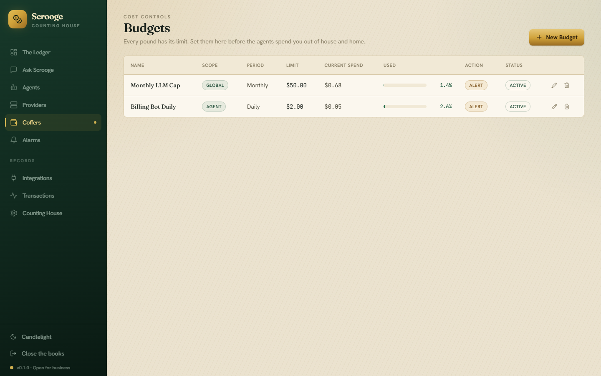
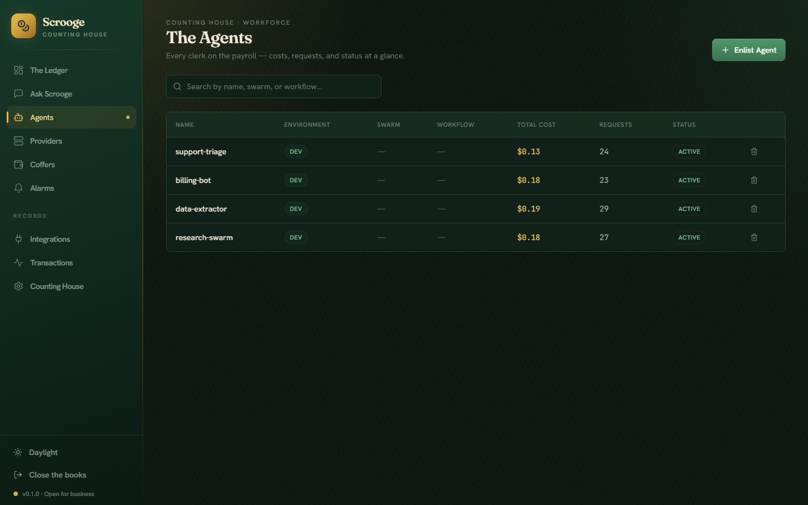
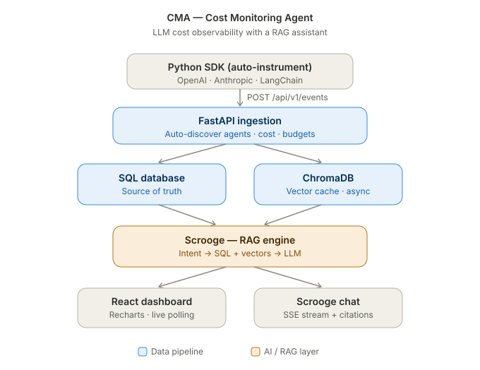

# CMA — Cost Monitoring Agent

**Self-hosted cost observability for multi-agent LLM systems.**
Capture every token your agents spend at the call site, attribute it per agent, model and provider, enforce budgets, and ask **Scrooge**, a built-in RAG assistant, why the bill moved.

[](https://github.com/See-137/CMA/actions/workflows/ci.yml)


---

## Why this exists

LLM applications leak money in ways ordinary APM never surfaces: a mis-routed model, an agent stuck in a retry loop, a swarm that quietly 10×'s its token use overnight, or one delegation path that is 60% of the bill and invisible in the provider dashboard.

CMA was built to answer three questions that provider billing pages cannot:

1. **Which agent spent what, on which model, for which workflow?**
2. **Is anyone about to blow the budget, and can we stop them before the call is made?**
3. **Why did spend change?** In plain language, with cited evidence.

It runs entirely on your own infrastructure. No usage data leaves your network.

## Features

- **Auto-instrumenting Python SDK.** One call patches OpenAI, Anthropic and LangChain clients in place, covering sync, async and **streaming** paths. It captures tokens and cost and never alters or breaks the underlying LLM call: SDK failures degrade silently, and events are sent from a background worker with retry and bounded backoff.
- **Cost engine and attribution.** Per-agent, per-model and per-provider rollups, agent auto-discovery from incoming events, idempotent daily aggregation, and retention pruning. Provider price tables are editable from the UI.
- **Budgets, enforcement and alerts.** Threshold alerts at 50, 75, 90 and 100 percent, optional hard-stop enforcement, and webhook or Slack delivery behind an **SSRF guard** (private-network targets are rejected unless explicitly allowed).
- **Scrooge, the RAG assistant.** Hybrid retrieval that combines vector search over events and rollups (ChromaDB + sentence-transformers) with exact SQL aggregations chosen by regex intent detection. "What did we spend last week" hits SQL and returns a real number; "why did the research agent get expensive" hits the vector store and returns cited sources. The LLM is used for answer generation only, streamed token by token.
- **Dashboards and semantic search.** Recharts visualizations of spend over time, top agents, model mix and budget status, plus meaning-based search across events.
- **Production observability.** Liveness and readiness endpoints with bounded dependency checks, structured JSON logging with request-ID correlation, and a Prometheus exporter with a bundled Grafana dashboard.
- **Security hardening.** Constant-time comparison for every credential, an admin scope separated from the ingest key, dependency-free rate limiting on login and chat, input size caps, and a systemd unit with a locked-down sandbox for native deploys.

## Screenshots

| Light | Dark |
|---|---|
|  |  |
|  |  |
|  |  |

More views (alerts, providers, integrations, setup wizard) are in [`docs/screenshots/`](docs/screenshots/).

## Architecture



```
SDK ──POST /api/v1/events──▶ FastAPI ──▶ cost calc + agent auto-discovery
                                   │
                          (BackgroundTasks)
                                   ├──▶ embed to ChromaDB   (rebuildable cache)
                                   └──▶ budget check ──▶ alerts (webhook / Slack)

Daily maintenance loop: rollups ──▶ embedding backfill ──▶ retention prune
```

Design decisions worth knowing:

- **SQL is the source of truth; ChromaDB is a cache.** SQLite for development, PostgreSQL in production. The vector store can be dropped and rebuilt from SQL at any time via backfill, so a corrupted index is never a data-loss event.
- **Ingestion never waits on the slow parts.** Cost calculation happens inline; embedding and budget evaluation run as background tasks so the SDK's request returns fast and instrumentation adds negligible latency to the caller.
- **Intent routing before retrieval.** Scrooge classifies each question with regex intent detection (about 1 ms) and routes aggregate questions to SQL rather than the vector store. Retrieval-augmented generation is the wrong tool for "how much", so it is only used for "why".
- **Schema is owned by Alembic.** Migrations are applied before every start and CI verifies they are reversible against a real PostgreSQL.
- **The maintenance loop is single-instance.** It is enabled by config on exactly one worker so rollups and pruning do not run N times under a multi-replica deploy.

## Tech stack

| Layer | Choice |
|---|---|
| Backend | Python 3.10+, FastAPI, SQLAlchemy 2.x, Alembic, SQLite (dev) / PostgreSQL (prod) |
| RAG | ChromaDB, sentence-transformers (`all-MiniLM-L6-v2`), OpenAI or Ollama for generation |
| Frontend | React 18, TypeScript, Vite, Tailwind CSS, Recharts |
| SDK | Python, `httpx`, optional extras for `openai`, `anthropic`, `langchain` |
| Observability | Prometheus, Grafana, structured JSON logs |
| Delivery | Docker Compose, systemd, GitHub Actions |

## Quickstart

### Docker

```bash
docker compose up -d
```

Open <http://localhost:5173> and complete the setup wizard. The wizard creates the admin credentials and shows the ingest API key; copy it for the SDK. If you lose it, the Reconnect screen returns it after admin login.

To add Prometheus and Grafana:

```bash
docker compose --profile observability up -d
```

Grafana is at <http://localhost:3000> with the CMA dashboard pre-provisioned.

### Local development

Backend (API at <http://localhost:8000>, interactive docs at `/docs`):

```bash
cd backend
pip install -r requirements.txt
alembic upgrade head
uvicorn app.main:app --reload
```

Frontend (<http://localhost:5173>, proxies `/api` to the backend):

```bash
cd frontend
npm install
npm run dev
```

On Windows, `cma-dev.ps1` starts both with one command.

### Configuration

Copy `.env.template` to `.env` in the repo root. Every backend setting uses the `CMA_` prefix. The ones you are most likely to touch:

| Variable | Default | Purpose |
|---|---|---|
| `CMA_DATABASE_URL` | `sqlite:///./data/cma.db` | SQLAlchemy URL; use a `postgresql://` URL in production |
| `CMA_LLM_PROVIDER` | `ollama` | `ollama` or `openai` for Scrooge's answer generation |
| `CMA_LLM_MODEL` | `llama3` | Model name for the chosen provider |
| `CMA_OPENAI_API_KEY` | empty | Required when provider is `openai` |
| `CMA_OLLAMA_BASE_URL` | `http://localhost:11434` | Local Ollama endpoint |
| `CMA_EMBEDDING_MODEL` | `all-MiniLM-L6-v2` | sentence-transformers model, downloaded on first run |
| `CMA_RAG_TOP_K` | `10` | Retrieved chunks per question |
| `CMA_ALLOW_PRIVATE_WEBHOOKS` | `false` | Permit alert webhooks to private networks (disables the SSRF guard) |
| `CMA_ENABLE_MAINTENANCE` | `true` | Run the rollup / backfill / prune loop on this instance |
| `CMA_METRICS_TOKEN` | unset | Bearer token that gates the Prometheus endpoint |
| `CMA_SERVE_STATIC_DIR` | empty | Serve the built frontend from the API process (single-port native deploy) |

## SDK usage

Install from the repo (a PyPI release is not published yet):

```bash
pip install "sdks/python[all]"
```

Zero-config instrumentation:

```python
from cost_monitor import auto_instrument

auto_instrument(
    endpoint="http://localhost:8000",
    api_key="<ingest key from the setup wizard>",
)

# Use your LLM libraries exactly as before. Every call is now tracked.
from openai import OpenAI
OpenAI().chat.completions.create(model="gpt-4o", messages=[...])
```

Explicit control, for custom pipelines or non-patched providers:

```python
from cost_monitor import CostTracker

tracker = CostTracker(endpoint="http://localhost:8000", api_key="...", default_agent="research_agent")
tracker.log_event(model="gpt-4o", provider="openai", tokens_input=1500, tokens_output=500, workflow="rag_pipeline")
tracker.close()
```

See [`sdks/python/README.md`](sdks/python/README.md) for the full API and [`examples/sample_usage.py`](examples/sample_usage.py) for a runnable script.

### Instrumenting agents that are not Python

[`examples/hermes_hook_forwarder.py`](examples/hermes_hook_forwarder.py) shows how to feed CMA from an agent framework's post-request hook. It is stdlib-only, never blocks the agent, spools to a local file on transient failure, and folds Anthropic prompt-cache tokens into a billed-equivalent input count so cost stays accurate. The same shape works for any tool that can pipe JSON to a script.

## API

All routes are under `/api/v1` and require the ingest key (`X-API-Key`) except setup, auth and health. Destructive admin operations additionally require the admin password.

| Area | Endpoints |
|---|---|
| Ingest | `POST /events`, `GET /events` |
| Agents, providers, models | CRUD under `/agents`, `/providers`, `/models` |
| Budgets and alerts | CRUD under `/budgets`, `/alerts`, `/alerts/channels`; `PUT /alerts/{id}/resolve` |
| Dashboard | `/dashboard/overview`, `/timeseries`, `/top-agents`, `/model-usage`, `/budget-status` |
| Scrooge | `POST /chat`, `POST /chat/stream`, `GET /chat/status` |
| Search | `POST /search/semantic` |
| Admin | `/admin/status`, `/admin/logs`, `/admin/export`, `/admin/reset` |
| Health | `GET /health` (liveness), `GET /health/ready` (readiness with bounded DB and vector-store checks) |

The interactive OpenAPI docs at `/docs` are the authoritative reference.

## Deployment

**Docker Compose** is the default: PostgreSQL, backend, and an nginx-served frontend, with Prometheus and Grafana behind the `observability` profile.

**Native (no Docker)** is supported for small hosts. [`deploy/systemd/cma.service`](deploy/systemd/cma.service) runs migrations before every start, serves API and frontend from one port bound to localhost, and applies a strict systemd sandbox (`ProtectSystem=strict`, empty capability set, read-only home, private tmp and devices). Reach the dashboard over an SSH tunnel.

## Testing and CI

```bash
cd backend && pytest                 # backend suite, in-memory SQLite
cd sdks/python && pip install -e ".[dev]" && pytest   # SDK, incl. real openai/anthropic clients against a fake server
cd frontend && npm run build         # tsc + vite build
```

The backend and SDK suites together contain 89 test functions. The SDK instrumentation tests exercise the real `openai` and `anthropic` client libraries against a local fake HTTP server, so patching is verified against actual SDK internals rather than mocks.

CI runs on every push and pull request:

| Job | What it checks |
|---|---|
| `backend-lint` | ruff |
| `backend-test` | pytest |
| `migrations` | Alembic upgrade on a real PostgreSQL, then verifies every migration downgrades cleanly |
| `frontend-build` | TypeScript type-check and Vite production build |
| `docker-build` | Both images build |

## Project layout

```
backend/
  app/api/          FastAPI routers (events, agents, budgets, alerts, chat, search, admin, health)
  app/services/     cost_engine, budget_checker, alert_service, rag_engine, vector_store,
                    llm_provider, rollup, retention, rate_limit
  app/models/       SQLAlchemy models        app/schemas/   Pydantic schemas
  alembic/          migrations (source of truth for the schema)
  tests/
frontend/           React + TypeScript + Vite + Tailwind
sdks/python/        cost_monitor SDK and its tests
examples/           sample_usage.py, hermes_hook_forwarder.py
deploy/             systemd unit, Prometheus config, Grafana provisioning
docs/               architecture diagram, screenshots
```

## Status and roadmap

CMA is a working single-maintainer project used to monitor a personal multi-agent fleet. It is stable for that scale. Things not done yet, roughly in priority order:

- Publish the SDK to PyPI.
- Multi-user accounts. Today there is one ingest key and one admin password.
- Provider price-table sync from upstream pricing pages instead of manual entry.
- Quality evaluation for Scrooge: a golden question set with expected sources, run in CI.

Issues and pull requests are welcome.

## License

[MIT](LICENSE)
