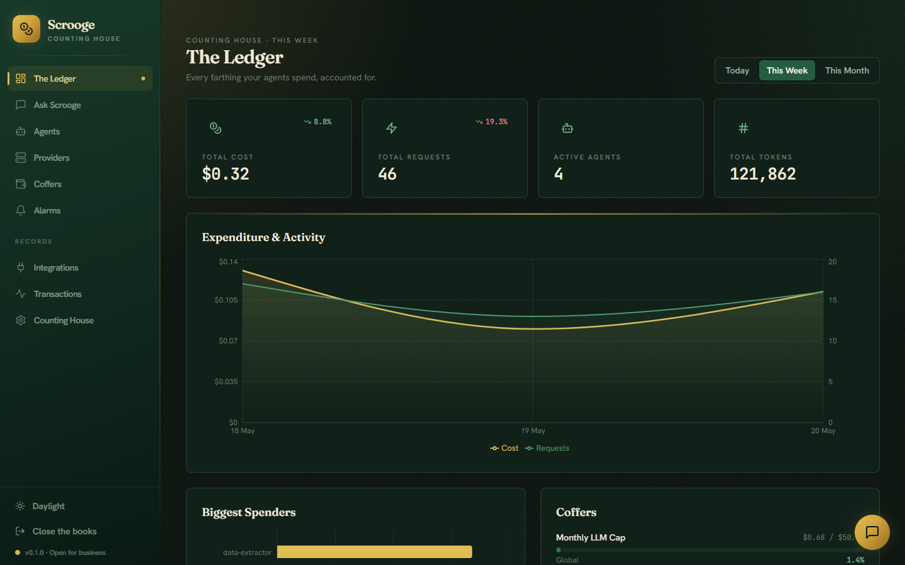
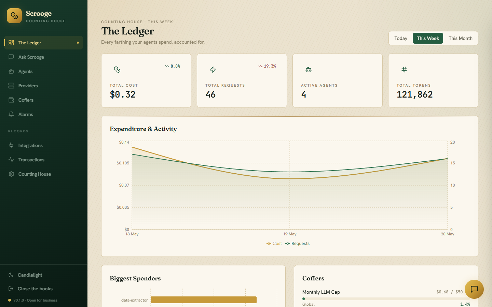
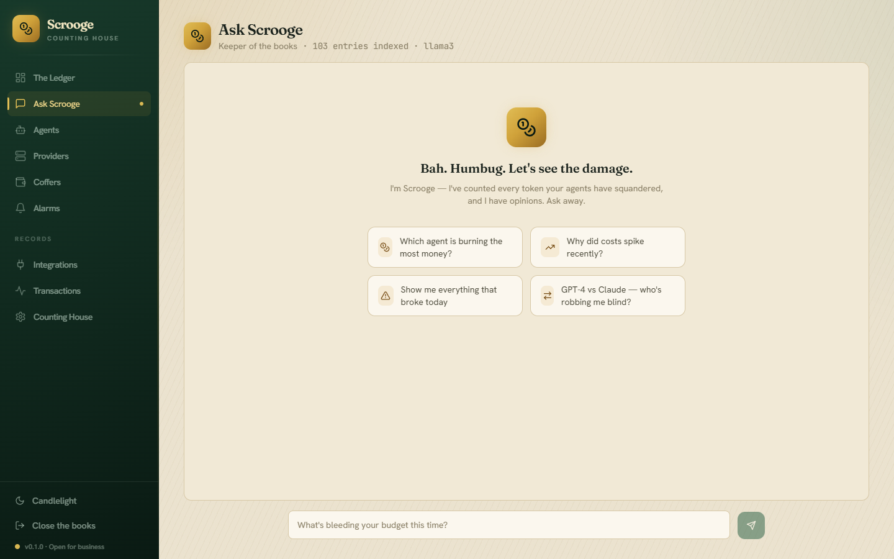
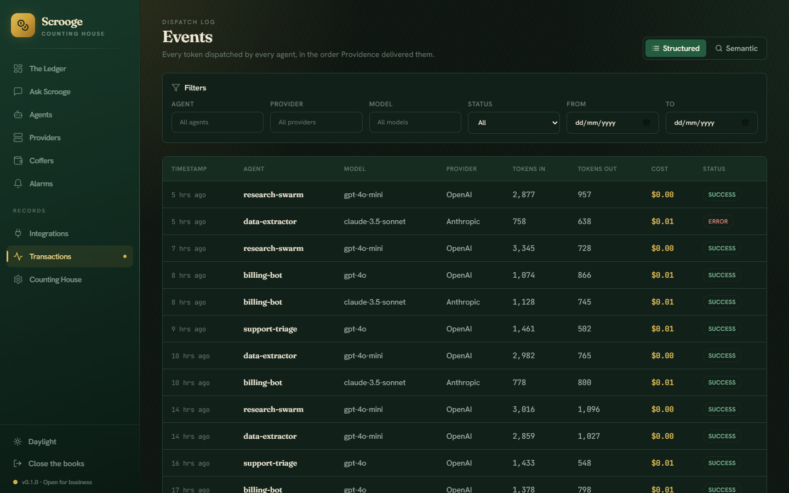

# CMA — Cost Monitoring Agent

**Self-hosted cost observability for multi-agent LLM systems.** Track every token
your agents spend, attribute it per agent / model / provider, enforce budgets,
and ask **Scrooge** — a built-in RAG assistant — why your bill moved.

[](https://github.com/See-137/CMA/actions/workflows/ci.yml)



---

## Why

LLM applications leak money in ways traditional APM doesn't surface: a single
mis-routed model, an agent stuck in a retry loop, or a swarm quietly 10×-ing its
token use overnight. CMA is a drop-in observability layer that captures cost at
the call site, makes it queryable, and puts guardrails (budgets + alerts) around
it — without shipping your data to a third party.

## Features

- **Auto-instrumenting Python SDK** — one call patches OpenAI, Anthropic, and
  LangChain (sync, async, and **streaming**). It captures tokens + cost and
  **never breaks or alters your actual LLM call** (failures degrade silently).
- **Cost engine & attribution** — per-agent / model / provider rollups, agent
  auto-discovery, idempotent daily aggregation, and retention pruning.
- **Budgets, enforcement & alerts** — thresholds (50/75/90/100%), hard-stop
  enforcement, and webhook/Slack delivery behind an **SSRF guard**.
- **Scrooge (RAG assistant)** — hybrid retrieval (ChromaDB + sentence-
  transformers) plus intent-based SQL, with cited sources. Regex intent
  detection (~1 ms) keeps the LLM call for answer generation only.
- **Dashboards & semantic search** — Recharts visualizations and meaning-based
  search over events.
- **Production hardening** — constant-time auth, an admin scope separated from
  the ingest token, dependency-free rate limiting, and input validation.

## Screenshots

| Light | Dark |
|---|---|
|  |  |
|  |  |

More under [`docs/screenshots/`](docs/screenshots/).

## Architecture

```
SDK ──POST /api/v1/events──▶ FastAPI ──▶ cost calc + agent auto-discovery
                                   │
                       (BackgroundTasks)
                                   ├──▶ embed to ChromaDB (rebuildable cache)
                                   └──▶ budget check ──▶ alerts (webhook/Slack)

SQL (SQLite dev / Postgres prod) is the source of truth.
ChromaDB is a cache — rebuilt from SQL via backfill.
A daily maintenance loop computes rollups, backfills embeddings, prunes events.
```

Scrooge answers by combining vector search over events/rollups with precise SQL
aggregations selected by lightweight intent detection.

## Tech stack

- **Backend** — Python 3.10+, FastAPI, SQLAlchemy 2.x, SQLite (dev) / PostgreSQL (prod)
- **Frontend** — React 18, TypeScript, Vite, Tailwind CSS, Recharts
- **RAG** — ChromaDB + sentence-transformers (`all-MiniLM-L6-v2`), OpenAI or Ollama for generation
- **SDK** — Python client with auto-instrumentation (`sdks/python/`)
- **Infra** — Docker Compose (postgres + backend + nginx-served frontend), GitHub Actions CI

## Quickstart

### Docker (everything)

```bash
docker compose up -d
```

Then open <http://localhost:5173> and complete the setup wizard.

### Local dev

```bash
# Backend (http://localhost:8000, docs at /docs)
cd backend
pip install -r requirements.txt
alembic upgrade head          # apply the schema (Alembic is the source of truth)
uvicorn app.main:app --reload

# Frontend (http://localhost:5173, proxies /api -> :8000)
cd frontend
npm install
npm run dev
```

Configuration is via a root `.env` (copy from `.env.template`). All backend
settings use the `CMA_` prefix. By default chat uses a local Ollama; set
`CMA_LLM_PROVIDER=openai` and `CMA_OPENAI_API_KEY=...` to use OpenAI.

### First run

On first launch a 4-step wizard configures the instance — admin login, deployment
+ locale, providers to track, and a starting daily budget — then issues an API key
to connect your agents.

| Guided setup | Ready to go |
|---|---|
|  |  |

## SDK usage

```python
from cost_monitor import auto_instrument

# Zero-config: patches OpenAI / Anthropic / LangChain in place.
auto_instrument(
    endpoint="http://localhost:8000",
    api_key="<your CMA api key>",   # shown once after setup
)

# Use your LLM libraries normally — every call is now tracked.
from openai import OpenAI
OpenAI().chat.completions.create(model="gpt-4o", messages=[...])
```

Prefer explicit control? Use `CostTracker` directly — see
[`examples/sample_usage.py`](examples/sample_usage.py).

## Testing

```bash
cd backend && pytest        # ~37 tests, in-memory SQLite
cd frontend && npm run build # tsc + vite build
```

CI runs backend lint (ruff), backend tests, frontend build, and Docker builds on
every PR and push to `master`.

## What this project demonstrates

Production-minded full-stack engineering: a hybrid RAG pipeline over operational
data, an auto-instrumenting client SDK, failure-isolated background processing,
security hardening (auth, SSRF, rate limiting, least-privilege admin scope), a
typed React frontend with a custom design system, and a CI/Docker workflow.
